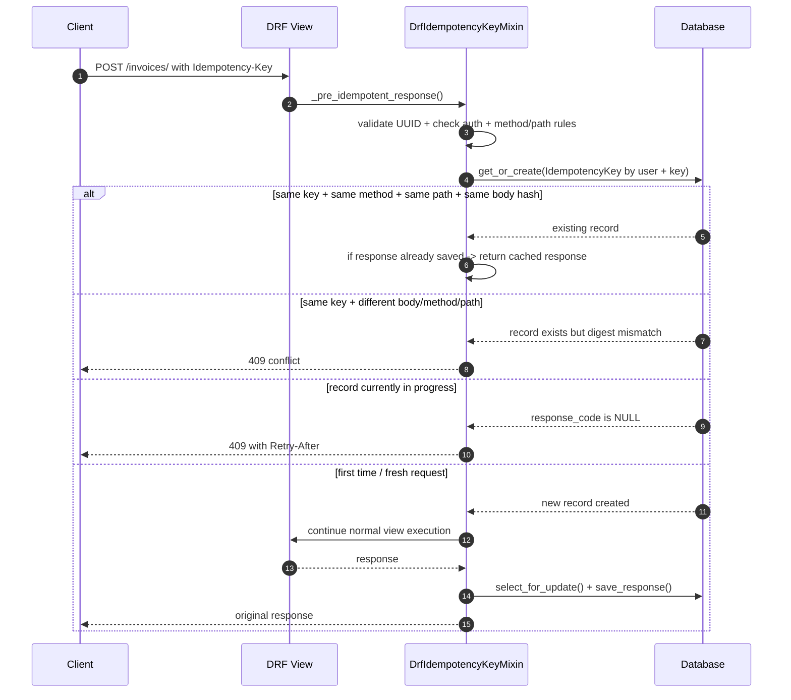

# drf-idempotencykey

Idempotent API requests for Django REST Framework, built for real-world services that need safe retry behavior without duplicate writes.

This package stores a request fingerprint per user and idempotency key, reuses the original response body, status, and replayable headers for repeat requests, and rejects mismatched requests with clear HTTP 400/409 responses.

## Why this package? 🚀

When the same client retries a POST, PUT, or PATCH request due to a timeout or mobile reconnect, a backend API should not create duplicate side effects. This package solves that by binding each idempotency key to:

- the authenticated user
- the HTTP method
- the full request path, including the query string
- the request body hash
- the original response payload

If the same key is replayed with the same payload, the API returns the cached response. If the same key is reused with different data, the request is rejected as a conflict.

## Requirements ✅

- Python 3.11+
- Django 5.2+
- Django REST Framework 3.15+

## Installation 📦

Using uv:

```bash
uv add drf-idempotencykey
```

Or with pip:

```bash
pip install drf-idempotencykey
```

Then add it to your Django project:

```python
INSTALLED_APPS = [
    # ...
    "rest_framework",
    "drf_idempotencykey",
]
```

## Quick start ⚡

Use the mixin on any DRF view that should be idempotent:

```python
from rest_framework.views import APIView
from rest_framework.response import Response
from drf_idempotencykey.mixins import DrfIdempotencyKeyMixin


class CreateInvoiceView(DrfIdempotencyKeyMixin, APIView):
    def post(self, request):
        # Your side-effecting logic goes here
        return Response({"status": "created"})
```

Then send the `Idempotency-Key` header from the client:

```http
POST /api/invoices/
Idempotency-Key: 550e8400-e29b-41d4-a716-446655440000
Content-Type: application/json
```

The same request replayed with the same key and body will return the original response instead of running the action again.

## How it works 🔄

The package links each request to a unique `(user, key)` record and then verifies the request signature before allowing a retry to reuse the cached response. The key is derived from the authenticated user, the idempotency key itself, the request method, the request path, and a hash of the request body.



A few important details:

- The request fingerprint is tied to the authenticated user, so the same idempotency key is not shared across users.
- The request fingerprint includes the full path and query string, so changing query parameters with the same key is a conflict.
- The record is protected with a `select_for_update()` lock when checking or saving the response, so concurrent duplicates are serialized.
- If a request is still in progress, the second caller gets a 409 with `Retry-After`; if the key is reused with different request parameters, it also gets a 409.
- Once a successful response is saved, later retries with the same request return the original cached body, status, end-to-end response headers, and cookies. Hop-by-hop and representation headers are regenerated or omitted.

## Configuration 🛠️

You can customize the package behavior in `settings.py`:

```python
IDEMPOTENCY_KEY_EXPIRATION_MINUTES = 60
IDEMPOTENCY_KEY_CLEANUP_INTERVAL_HOURS = 24
IDEMPOTENCY_KEY_EXEMPT_PATH_RE = r"^/healthz/?$|^/auth/"
IDEMPOTENCY_KEY_HEADER = "Idempotency-Key"
```

### Settings

These are the settings currently supported by the package:

- `IDEMPOTENCY_KEY_EXPIRATION_MINUTES`: how long a cached idempotency key stays valid before it can be reused for a fresh request. Default: `60`.
- `IDEMPOTENCY_KEY_EXEMPT_PATH_RE`: regex for paths to skip idempotency enforcement on, for example health checks and auth endpoints. Default: `""`.
- `IDEMPOTENCY_KEY_HEADER`: HTTP header name to read for the idempotency key. Default: `"Idempotency-Key"`.
- `IDEMPOTENCY_KEY_METHODS`: iterable of HTTP methods that participate in idempotency enforcement. Default: `("POST", "PUT", "PATCH")`.
- `IDEMPOTENCY_KEY_REQUIRED`: if `True`, requests on configured methods without the idempotency header are rejected with a 400 before the view runs. Default: `False`.
- `IDEMPOTENCY_KEY_MAX_BODY_SIZE`: maximum request or response body size in bytes. An oversized request bypasses idempotency enforcement; an oversized response is returned but its idempotency record is deleted, so retries can execute the view again. Both cases log a warning. Default: unset/disabled.
- `IDEMPOTENCY_KEY_RETRY_AFTER_SECONDS`: `Retry-After` value attached to the in-progress 409 response when a duplicate request is already being processed. Default: `5`.
- `IDEMPOTENCY_KEY_CLEANUP_INTERVAL_HOURS`: legacy scheduling hint for external cron/beat jobs. The package has a shared `.expired()` queryset and does not currently use this value in the runtime cleanup logic itself; schedule the job outside the app as needed. Default: `24`.

This is the complete current public surface of settings in the package. Additional settings are not necessary today; the most plausible future candidates would be a stricter global request redaction policy, a custom expiry predicate, an per-view opt-in/opt-out registry, or a custom retry policy hook, but those would be additive and should be introduced only if real production needs appear.

## Testing helpers 🧪

This repo also includes a small testing toolkit you can reuse in your own Django project to validate the same endpoint both with and without an idempotency key.

```python
from rest_framework.test import APITestCase
from drf_idempotencykey.testing import IdempotencyAPIClient


class MyEndpointTests(APITestCase):
    def test_endpoint_without_idempotency_key(self):
        response = self.client.post("/api/invoices/", {"amount": 10}, format="json")
        self.assertEqual(response.status_code, 200)

    def test_endpoint_with_idempotency_key(self):
        client = IdempotencyAPIClient()
        client.force_authenticate(user=self.user)
        response = client.post(
            "/api/invoices/",
            {"amount": 10},
            format="json",
            HTTP_IDEMPOTENCY_KEY="550e8400-e29b-41d4-a716-446655440000",
        )
        self.assertEqual(response.status_code, 200)
```

For tests where you want the repeated-request check to be automatic, use the decorator:

```python
from drf_idempotencykey.testing import add_idempotency_test


class OrderCancellationTests(APITestCase):
    @add_idempotency_test
    def test_cancel_order(self):
        order = OrderFactory(shop=self.shop)
        response = self.cancel_order(order.api_id, {"cancellation_reason": "duplicate"})
        self.assertEqual(response.status_code, 204)
```

That decorator runs the test once, then replays the same request with the same idempotency key and checks that the cached response is returned.

The generated helper test always follows the pattern `<original_test_name>_idempotent`. For example:

- `test_cancel_checkout_session` becomes `test_cancel_checkout_session_idempotent`
- `test_successfully_cancel_checkout_session_with_previous_status_created` becomes `test_successfully_cancel_checkout_session_with_previous_status_created_idempotent`

The original test checks the standard behavior; the generated one verifies the retry-safe behavior by replaying the exact same request with the same idempotency key and asserting the cached response is returned.

## API behavior 🔍

The mixin is active for these HTTP verbs only:

- `POST`
- `PUT`
- `PATCH`

It is ignored for:

- `GET`
- `DELETE`
- `OPTIONS`
- `HEAD`
- unauthenticated requests
- paths matching `IDEMPOTENCY_KEY_EXEMPT_PATH_RE`

### Duplicate retry response

On a repeat request with the same key, method, path, and payload, the API returns the cached response, including the header:

```http
Cached-From-Idempotency-Key: 550e8400-e29b-41d4-a716-446655440000
```

### Conflict response

If the same idempotency key is reused with a different payload or method, the API responds with a 409 error:

```json
{
  "status_code": 409,
  "title": "Idempotency key error",
  "errors": [
    {
      "error_code": "IDEMPOTENCY_KEY_IN_USE_WITH_DIFFERENT_REQUEST",
      "reason": "Request parameters do not match the original request."
    }
  ]
}
```

## Security & data retention 🔐

This package intentionally stores a small amount of request metadata for replay safety, but it does not guarantee that raw request or response bodies are safe to persist in production. Full payloads may include passwords, API tokens, card numbers, PII, or other sensitive values.

To avoid storing raw sensitive request material, override the mixin hook on your view class:

```python
from drf_idempotencykey.mixins import DrfIdempotencyKeyMixin


class CreateInvoiceView(DrfIdempotencyKeyMixin):
    @staticmethod
    def redact_body(body: str) -> str:
        # replace or strip sensitive fields before persisting
        return "[REDACTED]"
```

The default implementation is a no-op, so if you do not override it the original request body text will be stored verbatim. This hook applies only to request bodies. Response bodies, replayable response headers, and cookies are also stored verbatim because they are needed for replay; avoid caching responses containing secrets or sensitive data, or provide a custom storage/redaction policy with the understanding that redacted cached responses will differ from the original response. This is convenient for development but should not be considered production-safe by default for sensitive endpoints.

In addition, the project removes `request_body` from the default Django admin search fields so it is not exposed through the admin UI by default, but you should still treat the field as sensitive data and plan for a retention policy or redaction layer.

## Binary / non-UTF-8 payloads 📦

This package stores the request fingerprint and response body metadata for replayed idempotent requests. The request body is stored as a UTF-8 text representation with replacement characters for invalid bytes, and the response body is cached as text when the response is text-like (`application/json`, `text/*`, or XML). For binary payloads or other content types that cannot be represented safely as UTF-8 text, the package skips persisting the raw response body and keeps the idempotency record only for the request metadata and status code. Streaming responses are not cached: their idempotency record is removed after the response is produced, so a retry can run the view again.

This is a deliberate safety tradeoff: it avoids crashing on binary downloads or other non-text responses, but it means binary or opaque response payloads are not replayed byte-for-byte. If your API serves file downloads or binary payloads, treat these endpoints as unsupported for strict response-body replay semantics.

## Optional cleanup task 🧹

This package includes a cleanup task for expired idempotency records. If you use Celery, register a periodic task in your project:

```python
from celery.schedules import crontab
from celery import Celery

app.conf.beat_schedule = {
    "cleanup-idempotency-keys": {
        "task": "drf_idempotencykey.tasks.cleanup_idempotency_keys",
        "schedule": crontab(hour=3, minute=0),
    },
}
```

If you are not using Celery, the model can still be used as a normal Django app; the task is optional. You can prune old records from any scheduler or cron job with:

```bash
python manage.py cleanup_idempotency_keys
```

## Example project configuration 🧩

```python
INSTALLED_APPS = [
    "django.contrib.admin",
    "django.contrib.auth",
    "django.contrib.contenttypes",
    "django.contrib.sessions",
    "django.contrib.messages",
    "django.contrib.staticfiles",
    "rest_framework",
    "rest_framework.authtoken",
    "drf_idempotencykey",
]

REST_FRAMEWORK = {
    "DEFAULT_AUTHENTICATION_CLASSES": [
        "rest_framework.authentication.SessionAuthentication",
        "rest_framework.authentication.TokenAuthentication",
    ]
}

IDEMPOTENCY_KEY_EXPIRATION_MINUTES = 60
IDEMPOTENCY_KEY_EXEMPT_PATH_RE = r"^/healthz/?$|^/auth/"
```

## Contributing 🤝

Install the dev environment with uv:

```bash
uv sync --group dev
uv run prek run --all-files
uv run ruff check .
uv run coverage run --source=drf_idempotencykey -m django test --settings=tests.settings
uv run coverage report
```

## License 📄

MIT
